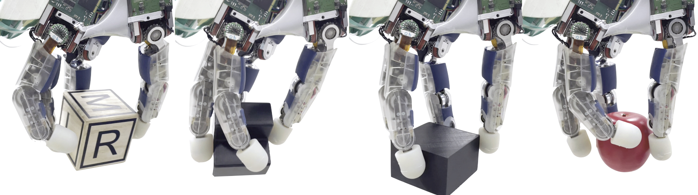
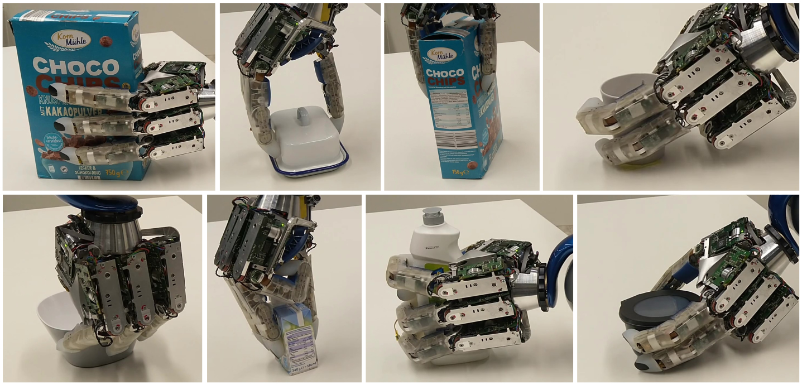

[Our research](https://youtu.be/CZBMXDM1_Tk "See a video about our research" target="_blank") in “Autonomous Learning AI” aims to bring human level autonomy and dexterity to humanoid robots like our DLR Agile Justin. The focus is on deep (reinforcement) learning based on first principles and simulation models (no human demonstrations or arbitrary internet videos ...) and the results are zero-shot transferred to the real system.

## [Purely Tactile In-Hand Manipluation](https://aidx-lab.org/manipulation/)
{:.this style="width: 1000px"}
Dextrous in-hand manipulation is a challenging problem in robotics. 
Due to modeling uncertainties, sensor noise, and other factors, classical control methods can not solve this problem until now. 
We work on this problem using reinforcement learning in simulation.
Crucially, our approach is to learn a controller without external sensors, such as cameras [[Sievers2022](https://aidx-lab.org/manipulation/icra22)].
This creates the need for an object state estimator based on purely tactile feedback [[Roestel2023](https://aidx-lab.org/manipulation/humanoids23)].
We combine a simple policy network with the state estimator in a modular architecture to keep as much insight into the system as possible [[Pitz2024](https://aidx-lab.org/manipulation/iros24)].

## [Grasping Unknown Objects with a Dextrous Hand](https://aidx-lab.org/grasping/)
{:.this style="width: 1000px"}
Grasping unknown objects with the 12-DoF DLR Hand II based on a single-view depth image in real-time.
* Using an analytical grasp planer, a large high-quality training dataset is generated which is used to tr  ain a generative grasping network that is able to generate 1000 grasps for a given unknown object in under 1s [[Winkelbauer2022](https://aidx-lab.org/grasping/iros22)]
* Combined with learning-based shape completion, we are able to grasp all kinds of objects only based on single depth image [[Humt2023](https://aidx-lab.org/grasping/humanoids23)]
* Determining the torques to apply in each joint based on the object shape and the given grasp to reduce involuntary object movement and increase efficiency [[Winkelbauer2023](https://aidx-lab.org/grasping/iros23)]

## [Fine Manipulation Using a Tactile Skin](https://aidx-lab.github.io/skin)
{:.this style="width: 1000px"}
Key for fine manipulation with a multi-fingered robotic hand is a spatially resolved tactile sensor. To apply modern deep reinforcement learning methods, we propose a novel model of a tactile skin that can be used together with rigid-body physics simulators [[Kasolowsky2024](https://aidx-lab.org/skin/iros24)].

## [Fast Whole-body Collision-free Motion Planning](https://aidx-lab.org/planning/)
{:.this style="width: 1000px"}
Fast and efficient motion planning in unknown environments is the basis for combining Agile Justin's individual skills to solve challenging tasks autonomously. 
* Supervised learning of optimal motions in unknown, challenging environments to speed up optimization-based motion planning [[Tenhumberg2022](https://aidx-lab.org/2022-iros-planning/)]
* Unsupervised learning of solutions to the ambiguous IK problem while tackling the different modes with a twin-head architecture [[Tenhumberg2023](https://aidx-lab.org/2023-humanoids-ik/)]

## [Automatic & Self-contained Calibration](https://aidx-lab.github.io/calibration/)
{:.this style="width: 1000px"}
An accurate model of the whole robot is crucial to perform dextrous manipulation and grasping.
We developed self-contained calibration routines from the elastic rope mechanism in the torso to the fingertips of the torque-controlled DLR-Hand II. 
* Calibration of an elastic robot model for a humanoid and its efficient compensation for motion planning [[Tenhumberg2021](https://aidx-lab.org/2021-humanoids-elastic/)]
* Self-contained calibration using the internal camera while maintaining high accuracy in the cartesian workspace [[Tenhumberg2022](https://aidx-lab.org/2022-humanoids-rgb/)]
* Calibration of a four-fingered hand using only pairwise self-contact [[Tenhumberg2023](https://aidx-lab.org/2023-humanoids-contact/)]

