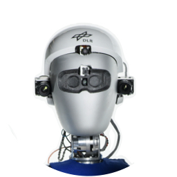

Agile Justin  
**Humanoid Robot**\\
19DoF, torque-controlled workhorse of the lab  
[justin@dlr.de](mailto:justin@dlr.de)  

 

Berthold Bäuml  
[Professor](https://campus.tum.de/tumonline/pl/ui/$ctx;design=pl;header=max;lang=DE/visitenkarte.show_vcard?pPersonenId=716BA3488FEBED66&pPersonenGruppe=3), head of lab\\
[berthold.baeuml@tum.de](mailto:berthold.baeuml@tum.de)\\
[LinkedIn](https://www.linkedin.com/in/berthold-bäuml-648b05288/),  [Google Scholar](https://scholar.google.com/citations?hl=en&user=fjvpDsEAAAAJ&view_op=list_works&sortby=pubdate)

   

Ulf Kasolowsky  
PhD Student, tactile sensing, fine manipulation \\
[ulf.kasowolsky@tum.de](mailto:ulf.kasowolsky@tum.de)

   

Felix Kroll  
PhD Student, tactile sensing, fine manipulation \\
[felix.kroll@tum.de](mailto:felix.kroll@tum.de)

   

Johannes Pitz  
PhD Student, reinforcement learning, in-hand manipulation \\
[johannes.pitz@tum.de](mailto:johannes.pitz@tum.de)

   

Lennart Röstel   
PhD Student, reinforcement learning, in-hand manipulation \\
[lennart.roestel@tum.de](mailto:lennart.roestel@tum.de)

   

Leon Sievers  
**PhD Student**\\
In-Hand manipulation, Control, Calibration \\
[leon.sievers@tum.de](mailto:leon.sievers@tum.de)\\
[LinkedIn](https://www.linkedin.com/in/leon-sievers/),  [Google Scholar](https://scholar.google.com/citations?user=i3pxG6IAAAAJ)

   

Finn Süberkrüb  
PhD Student, flight dynamics, V-TOL \\
[finn.suederkrueb@tum.de](mailto:finn.suederkrueb@tum.de)

   

Johannes Tenhumberg  
PhD Student, motion planning, calibration \\
[johannes.tenhumberg@tum.de](mailto:johannes.tenhumberg@tum.de)

   

Dominik Winkelbauer  
PhD Student, grasping \\
[dominik.winkelbauer@tum.de](mailto:dominik.winkelbauer@tum.de)

